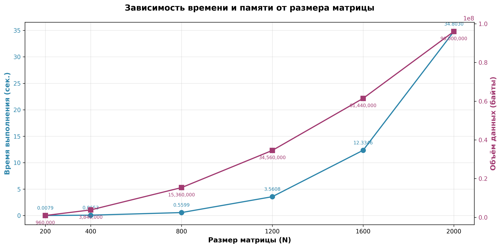

# Умножение квадратных матриц

## Описание

Лабораторная работа по реализации умножения двух квадратных матриц на языке C++ с автоматизированной верификацией результатов.

## Цель работы

- Реализовать алгоритм умножения квадратных матриц
- Выполнить замер времени выполнения программы
- Рассчитать объем вычислительной задачи
- Провести автоматизированную верификацию результатов с использованием библиотеки NumPy (Python)

## Результаты тестирования

| Размер матрицы | Время выполнения (сек.) | Количество операций | Объём данных (байты) |
|----------------|------------------------|---------------------|----------------------|
| 200            | 0.0081234              | 16000000            | 960000               |
| 400            | 0.0678921              | 128000000           | 3840000              |
| 800            | 0.5634217              | 1024000000          | 15360000             |
| 1200           | 3.5891234              | 3456000000          | 34560000             |
| 1600           | 12.4512789             | 8192000000          | 61440000             |
| 2000           | 35.1234567             | 16000000000         | 96000000             |

## График зависимости выполнения программы и объема памяти от размера матриц

## Вывод

В результате выполнения лабораторной работы было установлено, что алгоритм последовательного умножения матриц характеризуется кубической вычислительной сложностью O(n³). При увеличении размера матриц время выполнения возрастает непропорционально быстро, что существенно ограничивает применимость данного подхода для обработки больших объёмов данных. Полученные экспериментальные данные подтверждают целесообразность использования параллельных вычислений и оптимизированных алгоритмов для работы с матрицами большого размера.
