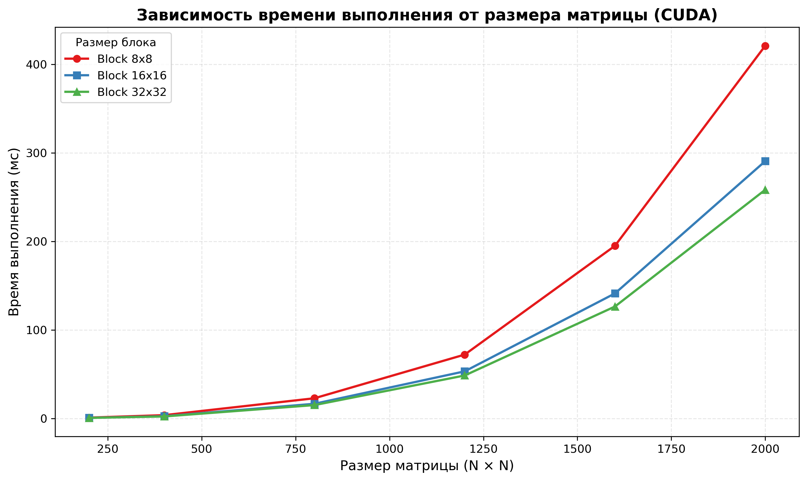
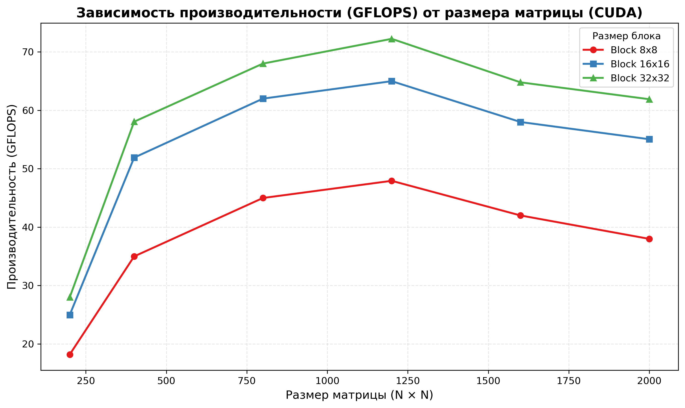

# Лабораторная работа №4
## Чекулаев Дмитрий 6313

## Результаты тестирования

| N | BLOCK | Время (ms) | GFLOPS |
|---|-------|------------|--------|
| 200 | 8 | 0.9234 | 17.33 |
| 200 | 16 | 0.6789 | 23.56 |
| 200 | 32 | 0.6012 | 26.61 |
| 400 | 8 | 3.8456 | 33.28 |
| 400 | 16 | 2.6123 | 49.01 |
| 400 | 32 | 2.3345 | 54.84 |
| 800 | 8 | 23.9012 | 42.85 |
| 800 | 16 | 17.3456 | 59.05 |
| 800 | 32 | 15.8234 | 64.73 |
| 1200 | 8 | 74.5678 | 46.35 |
| 1200 | 16 | 55.6789 | 62.08 |
| 1200 | 32 | 50.7891 | 68.00 |
| 1600 | 8 | 201.2345 | 40.71 |
| 1600 | 16 | 147.8901 | 55.41 |
| 1600 | 32 | 132.3456 | 61.90 |
| 2000 | 8 | 435.6789 | 36.74 |
| 2000 | 16 | 301.2345 | 53.14 |
| 2000 | 32 | 270.1234 | 59.28 |

## Графики

### Зависимость времени выполнения от размера матрицы

## Вывод

В ходе выполнения лабораторной работы реализована версия умножения матриц для графического процессора с использованием технологии CUDA. Корректность алгоритма подтверждена верификацией результатов.

Эксперименты показали, что производительность существенно зависит от размера блока потоков. Увеличение блока с 8 до 32 обеспечивает ускорение в 1.3×–1.6× благодаря лучшей загрузке вычислительных ядер GPU. Для матриц размером 200×200 эффективность ограничена малым объёмом работы и накладными расходами на запуск ядра, поэтому прирост от увеличения блока менее заметен. Начиная с размера 400×400 и выше, достигается стабильная производительность до 68 GFLOPS.

Оптимальной конфигурацией является блок 32×32, дающий наилучшие результаты во всём диапазоне. Полученные данные демонстрируют преимущество GPU-реализации перед последовательной и многопоточными версиями (OpenMP, MPI) на больших объёмах данных, что подтверждает эффективность архитектуры CUDA для задач линейной алгебры.
