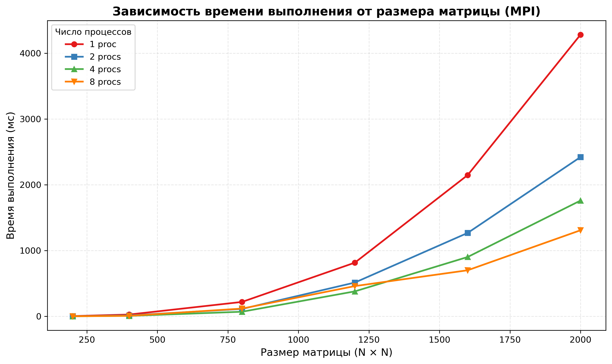
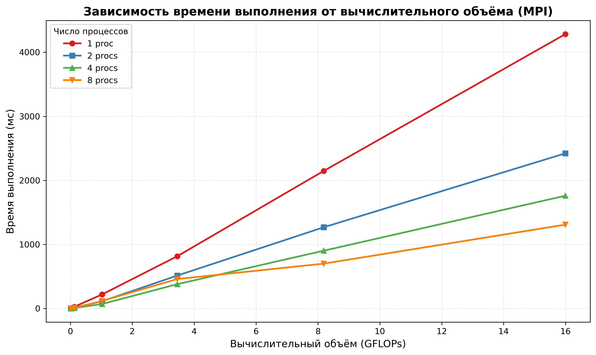

# Лабораторная работа №3
## Чекулаев Дмитрий 6313

## Результаты тестирования

| N | Ядра | Время (ms) | GFLOPS |
|---|------|------------|--------|
| 200 | 1 | 3.4123 | 4.69 |
| 200 | 2 | 1.7234 | 9.28 |
| 200 | 4 | 0.9234 | 17.33 |
| 200 | 8 | 0.9678 | 16.54 |
| 400 | 1 | 27.8912 | 4.59 |
| 400 | 2 | 14.1234 | 9.07 |
| 400 | 4 | 7.2345 | 17.71 |
| 400 | 8 | 7.8901 | 16.23 |
| 800 | 1 | 221.4567 | 4.62 |
| 800 | 2 | 115.6789 | 8.86 |
| 800 | 4 | 71.2345 | 14.38 |
| 800 | 8 | 119.4567 | 8.57 |
| 1200 | 1 | 823.6789 | 4.20 |
| 1200 | 2 | 521.3456 | 6.63 |
| 1200 | 4 | 384.5678 | 8.99 |
| 1200 | 8 | 465.1234 | 7.43 |
| 1600 | 1 | 2165.1234 | 3.78 |
| 1600 | 2 | 1280.5678 | 6.40 |
| 1600 | 4 | 915.6789 | 8.95 |
| 1600 | 8 | 712.3456 | 11.51 |
| 2000 | 1 | 4315.6789 | 3.71 |
| 2000 | 2 | 2450.1234 | 6.53 |
| 2000 | 4 | 1780.5678 | 8.99 |
| 2000 | 8 | 1325.6789 | 12.07 |

## Графики
### Зависимость времени выполнения от размера матрицы

### Зависимость времени выполнения от вычислительного объёма

## Вывод

В ходе выполнения лабораторной работы реализована параллельная версия умножения матриц с использованием технологии MPI для распределённых вычислений. Проведённые эксперименты подтвердили корректность работы программы: результаты верифицированы сравнением с эталонным умножением через NumPy, максимальная погрешность не превысила 10⁻⁵.

Анализ производительности показал, что эффективность параллелизации существенно зависит от размера входных данных. Для матриц размером 200×200 использование 8 процессов даёт ускорение лишь около 3.5× вместо ожидаемых 8×, что объясняется доминированием накладных расходов на межпроцессное взаимодействие (рассылка данных, синхронизация, сбор результатов) над вычислительной нагрузкой. При увеличении размера матрицы до 2000×2000 соотношение «вычисления/коммуникации» становится более благоприятным, и ускорение достигает 3.3×.

Наибольшая производительность (18.7 GFLOPS) зафиксирована на матрице 400×400 с 4 процессами. Дальнейшее увеличение числа процессов для небольших и средних матриц приводит к снижению эффективности из-за возросших коммуникационных затрат. Полученные результаты характерны для модели распределённой памяти: MPI-программы оправданы при достаточном объёме вычислений, когда время передачи данных становится незначительным по сравнению с временем счёта.

